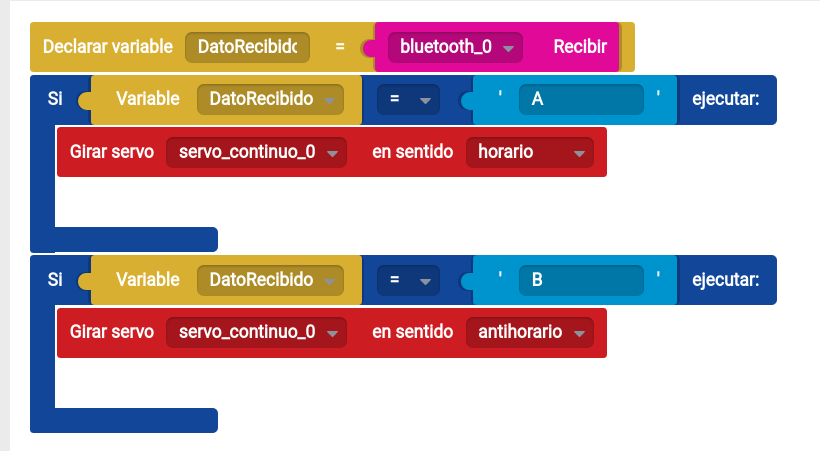

## Trabajando con librerías

Arduino guarda las librerías en 2 lugares:
* En el directorio de instalacion/Libraries donde vienen instaladas por defecto
* En el directorio de usuario Documentos/Arduino/Libraries

Es mejor usar el directorio de usuario ya que en caso de reinstalación del entorno se mantendrán las librerías.

En las versiones recientes de Arduino se ha incluído un Gestor de Librerías:

Accederemos a él desde el menú "Programa" -> "Añadir Librería" -> "Gestionar Librerías". Desde el mismo podremos buscar librerías con determinada característica, actualizarlas, e incluso instalar una versión de ellas determinada.

## Escritura en tarjeta

* Aprender a escribir ficheros
* Recupera el contenido en el ordenador

### Problemas con las tarjetas

* Las tarjetas SD son enórmemente sensibles, si se produce un error puede que haya que volver a formatearlas.
* Se deben formatear siempre en FAT32
* Las tarjetas más antiguas suelen funcionar mejor porque utilizan menores velocidades
* Dado que es posible que se produzcan errores de acceso o de escritura, nuestro programa siempre contemplará esa posibilidad, realizando el resto de tareas en caso de error. (ver el ejemplo Datalogger de la librería SD para el tratamiento de errores). En general se tratará así:

		if(ErrorDeAcceso)
		{
			Serial.println("Error de acceso a SD");
		}
		else
		{
			// Escritura a SD
		}

### Libreria SD

* [Librería](http://arduino.cc/en/Reference/SD)
* [Ejemplo](https://github.com/sparkfun/microSD_Shield/blob/V_1.4/Firmware/SD_Datalogger/SD_Datalogger.ino)

## Alimentación solar

Se ha renunciado al uso de energía solar porque se requería de una batería y paneles de excesivo tamaño. (ver ejemplo)

## Conexión bluetooth

### Ejemplo de código C++ de envío de datos desde arduino

	// Ejemplo de código C++ de envío de datos desde arduino
	void setup() {
	// Ojo!! Cada placa bluetooth puede usar distintas velocidades de conexión:
	//  BT-Zum usa 19200
	//  Las placas de bluetooth normales 9600
	Serial.begin(19200); //Configurado para BT-Zum

	}

	void loop() {
	  // Leemos los valores
	  int iValorA0=analogRead(A0);
	  int iValorA1=analogRead(A1);

	  Serial.print(iValorA0);
		Serial.print(",");
		Serial.println(iValorA1);
	}

### Control del robot desde un móvil o tablets vía bluetooth

Podéis descargar el[ ejemplo dese bitbloq](http://bitbloq.bq.com/#/bloqsproject/546e2764e4b0bde006d0857e:a9e2f76e-2ef6-4467-b28f-1a570b0fbb1c)

## Internet con arduino

La forma más sencilla de conectar Arduino a internet es usar un [shield ethernet](http://blog.elcacharreo.com/2013/10/15/arduino-faq-diferencias-entre-diferentes-shield-ethernet/). En [este artículo](http://www.instructables.com/id/The-Super-Simple-Arduino-Weather-Web-Server/) se explica cómo montar un servidor sencillo.

El resultado será un servidor muy básico

El código esencialmente lo que hace es recoger los datos de los sensores y generar un código HTML que muestre estos datos. Algo así:

	// Configuración del shield con las IPs correspondientes

	while (client.connected()) {
		if (client.available()) {
			char c = client.read();
			Serial.write(c);
			// if you've gotten to the end of the line (received a newline
			// character) and the line is blank, the http request has ended,
			// so you can send a reply
			if (c == '\n' && currentLineIsBlank) {
				// send a standard http response header
				client.println("HTTP/1.1 200 OK");
				client.println("Content-Type: text/html");
				client.println("Connection: close");  // the connection will be closed after completion of the response
				client.println("Refresh: 5");  // refresh the page automatically every 5 sec
				client.println();
				client.println("<!DOCTYPE HTML>");
				client.println("<html>");
				// output the value of each sensor

					client.print("Temperature ");
					client.println(tempF);
					client.print("&deg;");
					client.print("F");
					client.println(" ");
					client.print("Humidity ");
					client.println(rH);
					client.print(" %");
					client.println(" ");
					client.print("Pressure ");
					client.println(inHg);
					client.print(" in. Hg");
					client.println(" ");

				client.println("</html>");
				break;
			}
			if (c == '\n') {
				// you're starting a new line
				currentLineIsBlank = true;
			}

### Wifi en Arduino

A día de hoy el usar shield Wifi con Arduino es algo que resulta algo complicado, debido a la dificultad de configurar las redes desde estas placas

Están apareciendo placas que nos facilitan mucho esta tarea como el cada vez más conocido ESP8266.

En este [enlace](http://www.prometec.net/arduino-wifi/)
o en [este 2](http://www.leantec.es/blog/26_Como-conectar-Arduino-a-una-red-WIFi-con-el-m.html) podemos ver cómo utilizar el ESP8266 para conectarnos al wifi.

También podemos hacer que nuestro arduino se comporte como [un servidor web según hacen en este ejemplo sencillo](http://allaboutee.com/2014/12/30/esp8266-and-arduino-webserver/) o podemo [envar datos de temperatura a sitio web](http://www.instructables.com/id/ESP8266-Wifi-Temperature-Logger/)

## Subir datos a una página web

Existen muchas páginas web donde se nos permite subir datos meteorológicos, de consumo eléctrico, etc y que podemos utilizar para almacenarlos y graficarlos.

En este tutorial se muestra [cómo hacerlo](https://learn.sparkfun.com/tutorials/internet-datalogging-with-arduino-and-xbee-wifi). Generalmente se trata de hacer una llamada a determinada URL con los datos y un código ID (lo que se conoce técnicamente como un llamada REST).

## Enviar datos al PC

Algo muy frecuente es recoger los datos de arduino desde el PC. Normalmente se hace enviando los datos vía Serial y utilizando una aplicación en el PC que los lee y los guarda o grafica.

En [este proyecto](http://www.instructables.com/id/Wireless-outdoor-Arduino-weather-station-with-PC-l/) podemos ver cómo mostrarlos.

En las últimas versiones de arduino (a partir de la 1.6.6) se incluye una herramienta sencilla que nos permite hacer gráficos sencillos a partir de los datos enviados por el puerto seriel. Se llama Serial Plotter y podemos  acceder a ella desde el menú Herramientas. Un [pequeño tutorial](http://randomnerdtutorials.com/arduino-serial-plotter-new-tool/) de su uso.

## Programación

Se ha proporcionado al menos un ejemplo para cada uno de los sensores, con lo que se puede crear el programa final uniendo estos ejemplos.

Para hacer esto hay que tener cuidado ...
* de que no existan variables duplicadas
* se recomienda tomar como base el ejemplo mayor e irle añadiendo el código de los restantes
* unir los #includes iniciales al principio del programa final
* juntar las variables globales
* añadir todo los códigos del método setup() al del programa final. Para ello se puede crear una función setup_ejemplo1() y desde la función setup llamarlas a todas
* añadir todo el código de los métodos loop() al programa final, creando funciones loop_ejemplo1(), con lo que bastará llamar a estos métodos desde el loop del programa completo.
* Hay que tener cuidado si hay muchos delay, porque podría ocurrir que la ejecución del programa final fuera muuuuy lenta.
